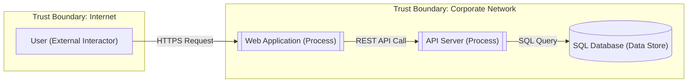
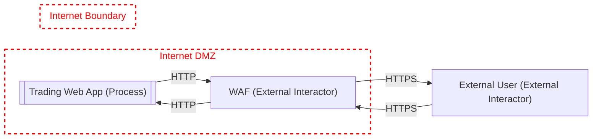
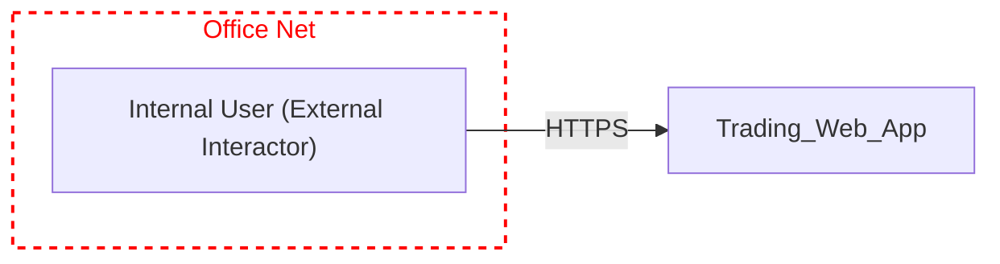

# Threat Modeling Skill

Generate, review, and maintain threat models compatible with the Microsoft Threat Modeling Tool (.tm7 format). Supports a human-friendly Markdown+Mermaid intermediate format for editing and review, with round-tripping to/from TM7 XML.

## Overview

The Microsoft Threat Modeling Tool uses the STRIDE methodology (Spoofing, Tampering, Repudiation, Information Disclosure, Denial of Service, Elevation of Privilege) to identify threats against a data-flow diagram. TM7 files are large XML documents that embed:

- **Drawing surfaces** — visual DFD elements (processes, data stores, external interactors, trust boundaries)
- **Data flows** — connections between elements with security properties
- **Threat instances** — STRIDE threats generated or manually added, with state/priority/mitigations
- **Knowledge base** — element type definitions and threat generation rules

Because TM7 XML is verbose and not human-editable, this skill uses a **Markdown threat model** as the primary authoring format. The CLI can convert between formats.

## Workflow

### 1. Generate a threat model from a code repository

Analyze the repo structure, identify components, and create a Markdown threat model:

1. Explore the codebase to identify: services/processes, data stores, external dependencies, trust boundaries, data flows, authentication mechanisms
2. Create a Markdown threat model file (see format below)
3. Convert to TM7 using the CLI

### 2. Review and iterate with user feedback

The Markdown format lets users easily:
- Add/remove/rename elements
- Update threat status (Mitigated, Not Applicable, Needs Investigation)
- Add justifications and mitigations
- Adjust priority and risk ratings

### 3. Export to TM7

Convert the reviewed Markdown back to TM7 for use with the Microsoft Threat Modeling Tool.

## Usage

All commands below assume you are in the skill directory (the folder containing `tm7_cli.py`).

```bash
python tm7_cli.py <command> [options]
```

Use `--help` on any subcommand for details.

### Commands

| Command | Description | Key Options |
|---------|-------------|-------------|
| `parse` | Parse a TM7 file to Markdown | `--input <tm7>`, `--output <md>` |
| `generate` | Generate a TM7 from Markdown | `--input <md>`, `--output <tm7>`, `--template <tm7>` |
| `summary` | Print a brief JSON summary of a TM7 file | `--input <tm7>`, `--output-file <json>` |
| `update-threats` | Update threat states/mitigations in a TM7 from Markdown | `--tm7 <tm7>`, `--markdown <md>`, `--output <tm7>` |
| `validate` | Validate a Markdown threat model for completeness | `--input <md>` |

### Examples

```bash
# Parse existing TM7 to editable Markdown
python tm7_cli.py parse --input model.tm7 --output model.md

# Generate TM7 from Markdown (optionally using existing TM7 as template for KB)
python tm7_cli.py generate --input model.md --output model.tm7
python tm7_cli.py generate --input model.md --output model.tm7 --template existing.tm7

# Quick summary of a TM7
python tm7_cli.py summary --input model.tm7

# Update just the threat states from reviewed Markdown back into existing TM7
python tm7_cli.py update-threats --tm7 model.tm7 --markdown reviewed.md --output updated.tm7

# Validate Markdown threat model for missing fields
python tm7_cli.py validate --input model.md
```

## Markdown Threat Model Format

The Markdown format is the **primary authoring surface**. It uses a structured Markdown document with Mermaid data-flow diagrams and tables for threats. Two layout modes are supported: **single-diagram** (flat) and **multi-diagram**.

### Single-Diagram Format

When a model has one diagram the sections are flat (H2-level):

````markdown
# Threat Model: [System Name]

## Metadata
- **Owner:** [name]
- **Reviewer:** [name]
- **Date:** [YYYY-MM-DD]
- **Description:** [High-level system description]
- **Assumptions:** [Key assumptions]
- **External Dependencies:** [External dependencies]

## Data Flow Diagram



## Elements

| Name | Type | Generic Type | Notes |
|------|------|-------------|-------|
| User | External Interactor | GE.EI | End user accessing via browser |
| Web Application | Process | GE.P | ASP.NET web frontend |
| API Server | Process | GE.P | REST API backend |
| SQL Database | Data Store | GE.DS | Azure SQL Database |

## Data Flows

| Name | Source | Target | Protocol | Authenticates Source | Provides Confidentiality | Provides Integrity |
|------|--------|--------|----------|---------------------|-------------------------|-------------------|
| HTTPS Request | User | Web Application | HTTPS | Yes | Yes | Yes |
| REST API Call | Web Application | API Server | HTTPS | Yes | Yes | Yes |
| SQL Query | API Server | SQL Database | SQL | Yes | No | No |

## Trust Boundaries

| Name | Elements |
|------|----------|
| Internet | User |
| Corporate Network | Web Application, API Server, SQL Database |

## Threats

### T1: SQL Injection on SQL Database
- **Category:** Tampering
- **State:** Needs Investigation
- **Priority:** High
- **Risk:** High
- **Description:** SQL injection is an attack in which malicious code is inserted into strings that are later passed to an instance of SQL Server for parsing and execution.
- **Target:** SQL Database
- **Source:** API Server
- **Flow:** SQL Query
- **Mitigation:** Use parameterized queries via ORM (Entity Framework / Hibernate)
- **Justification:**
````

### Multi-Diagram Format

When a model has **multiple diagrams** (TMT DrawingSurfaces), each diagram gets its own `## Diagram: <Name>` section with H3 subsections. The `## Threats` section remains top-level (shared across all diagrams).

````markdown
# Threat Model: Trading System

## Metadata
- **Owner:** Security Team
- **Date:** 2026-04-12

## Diagram: External Access

### Data Flow Diagram



### Elements

| Name | Type | Generic Type | Notes |
|------|------|-------------|-------|
| External User | External Interactor | GE.EI |  |
| Trading Web App | Process | GE.P |  |
| WAF | External Interactor | GE.EI |  |

### Data Flows

| Name | Source | Target | Protocol | Authenticates Source | Provides Confidentiality | Provides Integrity |
|------|--------|--------|----------|---------------------|-------------------------|-------------------|
| HTTPS | WAF | External User | SE.DF.TMCore.HTTPS | Yes | Yes | Yes |
| HTTPS | External User | WAF | SE.DF.TMCore.HTTPS | Yes | Yes | Yes |
| HTTP | WAF | Trading Web App | SE.DF.TMCore.HTTP | Yes | No | No |
| HTTP | Trading Web App | WAF | SE.DF.TMCore.HTTP | Yes | No | No |

### Trust Boundaries

| Name | Elements |
|------|----------|
| Internet DMZ | Trading Web App, WAF |
| Internet Boundary |  |

## Diagram: Internal Access

### Data Flow Diagram



### Elements

| Name | Type | Generic Type | Notes |
|------|------|-------------|-------|
| Trading Web App | Process | GE.P |  |
| Internal User | External Interactor | GE.EI |  |

### Data Flows

| Name | Source | Target | Protocol | Authenticates Source | Provides Confidentiality | Provides Integrity |
|------|--------|--------|----------|---------------------|-------------------------|-------------------|
| HTTPS | Internal User | Trading Web App | SE.DF.TMCore.HTTPS | Yes | Yes | Yes |

### Trust Boundaries

| Name | Elements |
|------|----------|
| Office Net | Internal User |

## Threats

### 25: Potential SQL Injection Vulnerability for SQL Database
- **Category:** Tampering
- **State:** Auto Generated
...
````

**Key multi-diagram rules:**
- Elements with the same name can appear in multiple diagrams (e.g., "Trading Web App" in all three). Each diagram keeps its own local GUIDs — no cross-diagram GUID sharing.
- Flows reference elements within the **same** diagram. A connector's source/target must exist in its own DrawingSurfaceModel's Borders.
- Trust boundaries are per-diagram. A boundary with the same name may appear in multiple diagrams with different contained elements.
- Bidirectional flows appear as two separate rows (one per direction).
- The parser auto-detects whether a Markdown file uses single-diagram or multi-diagram format.

### Element Type Reference

| Generic Type | Code | Mermaid Shape | Description |
|-------------|------|---------------|-------------|
| External Interactor | `GE.EI` | `["name"]` | External entity outside your control |
| Process | `GE.P` | `[["name"]]` | Software process / service |
| Data Store | `GE.DS` | `[("name")]` | Database, file system, cache |
| Data Flow | `GE.DF` | `-->` arrow | Data movement between elements |
| Trust Boundary | `GE.TB` | `subgraph` | Security boundary |

### STRIDE Categories

| Code | Category | Question |
|------|----------|----------|
| S | Spoofing | Can an attacker pretend to be something/someone else? |
| T | Tampering | Can an attacker modify data? |
| R | Repudiation | Can an attacker deny performing an action? |
| I | Information Disclosure | Can an attacker read data they shouldn't? |
| D | Denial of Service | Can an attacker crash or degrade the system? |
| E | Elevation of Privilege | Can an attacker gain unauthorized access? |

### Threat States

| State | Description |
|-------|-------------|
| `Needs Investigation` | Not yet reviewed |
| `Not Applicable` | Threat does not apply (provide justification) |
| `Mitigated` | Mitigation is in place (describe it) |
| `Not Started` | Acknowledged but not yet addressed |
| `Auto Generated` | Auto-generated by the tool, pending review |

## Generating a Threat Model from a Code Repository

When analyzing a repository, follow this process:

1. **Identify components**: Look for services, APIs, web apps, databases, message queues, caches, external integrations
2. **Map data flows**: Trace how data moves between components (HTTP, gRPC, SQL, message bus, file I/O)
3. **Identify trust boundaries**: Network segments, cloud/on-prem, internal/external, privileged/unprivileged
4. **Apply STRIDE per element**: For each element, consider which STRIDE categories apply
5. **Write the Markdown threat model** using the format above
6. **Convert to TM7** using: `python tm7_cli.py generate --input model.md --output model.tm7`

### Tips

- Focus on the most security-critical flows first
- External Interactors crossing trust boundaries generate the most threats
- Data flows crossing trust boundaries need confidentiality and integrity analysis
- Data stores holding credentials or PII need special attention
- Prefer specific TypeIds (e.g., `SE.P.TMCore.WebApp`) over generic ones when the component type is known

## TM7 Validation

A C# validation harness lives in `tools/tm7_validate.cs`. It uses TMT's own assemblies (auto-discovered from the ClickOnce install) to validate TM7 files the same way TMT would. Run it with:

```bash
cd tools
dotnet run -- ../samples/model.tm7
# or validate multiple files:
dotnet run -- ../samples/complex.tm7 ../samples/simple.tm7
```

The validator performs three phases:

| Phase | What it checks |
|-------|----------------|
| **Phase 1 — DCS Deserialization** | DataContractSerializer round-trip with TMT's `SerializableModelData` type and all 45 known types. Catches z:Id/z:Ref errors, missing namespaces, wrong element ordering. |
| **Phase 2 — XML Model Checks** | Line coordinates (source ≠ target), TypeId resolution against KnowledgeBase, nil GUID detection on connectors, stencil TypeId validation, zero-length connectors. |
| **Phase 3 — DSM Consistency** | DrawingSurfaceModel structure (GenericTypeId, Guid, Borders, Lines, Header, Zoom). Connector SourceGuid/TargetGuid must reference elements within the **same** DSM's Borders. Threat DrawingSurfaceGuids must reference a valid DSM. Border element coordinates within canvas bounds (~1500px). Duplicate connector endpoint detection. |

> **Important:** DCS deserialization passing (Phase 1) is necessary but **not sufficient** — TMT performs post-deserialization semantic validation that Phase 2 and Phase 3 catch.

## Technical Notes

### Per-Diagram Element GUIDs

Elements with the same name can appear in multiple TMT diagrams (DrawingSurfaces), each with a **different GUID**. The CLI preserves per-diagram GUIDs — it does not canonicalize across diagrams. This ensures connectors always reference elements within their own diagram, which TMT requires.

### Bidirectional Flows

TMT represents a bidirectional flow as **two connectors** sharing the same name, each with its own source/target direction. In the Mermaid DFD these render as two arrows. In the Markdown tables they appear as two rows. The TM7 generator emits two `<Connector>` elements with curve offsets (HandleY ± 50px) so they don't overlap.

### Trust Boundary Types

| Type | GenericTypeId | TM7 Representation |
|------|--------------|--------------------|
| Line boundary | `GE.TB.L` | `<Line>` in Lines |
| Border boundary | `GE.TB` | `<Border>` in Borders with geometric containment |

Border boundaries use geometric containment — an element is "inside" a boundary if its position falls within the boundary rectangle. The CLI handles this automatically during parse and generate.

### z:Id Allocation

TM7 uses `z:Id="iN"` / `z:Ref="iN"` for object identity within the DCS XML. When generating, the CLI scans the template for the maximum existing z:Id value and starts new allocations above it. This prevents collisions with KnowledgeBase entries.

### Coordinate Layout Constraints

TMT validates that element coordinates fall within a reasonable canvas area (~1200px wide). The CLI's layout engine automatically wraps boundary groups to new rows when the total width would exceed this limit. Key rules:

- **Canvas width limit**: Elements must stay within ~1200px horizontally. Models with many boundary groups are laid out in multiple rows.
- **Same-column connectors**: When source and target elements are stacked vertically (same Left coordinate), connectors use South/North ports instead of East/West to avoid U-shaped paths.
- **Parallel connectors**: When multiple flows share the same source and target elements, their endpoint coordinates are offset vertically by 15px to prevent complete overlap.
- **Border containment**: Elements inside a BorderBoundary must be geometrically within the boundary rectangle (handled automatically by the layout engine).

## Scratch Directory

The `_tmp/` folder inside the skill directory is checked in but its contents are git-ignored.
Use it for generated files and any other transient data.
