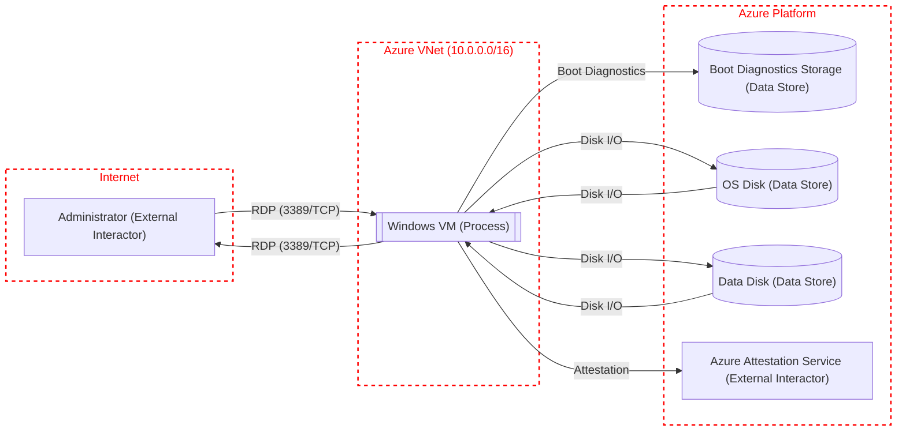

# Threat Model: Azure Simple Windows VM

## Metadata
- **Owner:** Security Team
- **Reviewer:** 
- **Date:** 2026-04-12
- **Description:** Threat model for an Azure quickstart template that deploys a Windows Server VM with a public IP, NSG allowing RDP from the internet, a VNet with one subnet, boot diagnostics storage, and optional TrustedLaunch with Guest Attestation.
- **Assumptions:** The VM is internet-facing via a public IP with RDP (3389) open to all source addresses. TrustedLaunch with Secure Boot and vTPM is enabled by default. Boot diagnostics are written to a dedicated storage account.
- **External Dependencies:** Azure platform, Microsoft Azure Attestation (MAA), Windows Server marketplace image

## Data Flow Diagram

## Elements

| Name | Type | Generic Type | Notes |
|------|------|-------------|-------|
| Administrator | External Interactor | GE.EI | Remote administrator accessing the VM via RDP over the internet through the public IP |
| Windows VM | Process | GE.P | Windows Server VM (Standard_D2s_v5) with TrustedLaunch, Secure Boot, and vTPM |
| Boot Diagnostics Storage | Data Store | GE.DS | Storage account (Standard_LRS) storing boot diagnostics screenshots and serial log |
| OS Disk | Data Store | GE.DS | Managed disk (StandardSSD_LRS) with Windows Server image |
| Data Disk | Data Store | GE.DS | 1023 GB empty managed data disk |
| Attestation Service | External Interactor | GE.EI | Microsoft Azure Attestation service for guest attestation via VM extension |

## Data Flows

| Name | Source | Target | Protocol | Authenticates Source | Provides Confidentiality | Provides Integrity |
|------|--------|--------|----------|---------------------|-------------------------|-------------------|
| RDP (3389/TCP) | Administrator | Windows VM | HTTPS | Yes | Yes | Yes |
| RDP (3389/TCP) | Windows VM | Administrator | HTTPS | Yes | Yes | Yes |
| Boot Diagnostics | Windows VM | Boot Diagnostics Storage | HTTPS | Yes | Yes | Yes |
| Disk I/O | Windows VM | OS Disk | HTTPS | Yes | Yes | Yes |
| Disk I/O | OS Disk | Windows VM | HTTPS | Yes | Yes | Yes |
| Disk I/O | Windows VM | Data Disk | HTTPS | Yes | Yes | Yes |
| Disk I/O | Data Disk | Windows VM | HTTPS | Yes | Yes | Yes |
| Attestation | Windows VM | Attestation Service | HTTPS | Yes | Yes | Yes |

## Trust Boundaries

| Name | Elements |
|------|----------|
| Internet | Administrator |
| Azure VNet (10.0.0.0/16) | Windows VM |
| Azure Platform | Boot Diagnostics Storage, OS Disk, Data Disk, Attestation Service |

## Threats

### T1: RDP Brute Force via Internet-Exposed Port
- **Category:** Spoofing
- **State:** Needs Investigation
- **Priority:** Critical
- **Risk:** Critical
- **Description:** The NSG rule 'default-allow-3389' allows inbound RDP from any source IP (sourceAddressPrefix: '*'). This exposes the VM to credential brute-force and password-spray attacks from the entire internet. Automated scanners constantly probe port 3389.
- **Target:** Windows VM
- **Source:** Administrator
- **Flow:** RDP (3389/TCP)
- **Mitigation:** Restrict sourceAddressPrefix to known admin IP ranges, or replace public RDP access with Azure Bastion or VPN Gateway. Enable Azure AD authentication and MFA for RDP. Consider Just-In-Time VM access in Microsoft Defender for Cloud.
- **Justification:**

### T2: Credential Theft from Template Parameters
- **Category:** Information Disclosure
- **State:** Needs Investigation
- **Priority:** High
- **Risk:** High
- **Description:** The adminPassword is passed as a Bicep parameter. While marked @secure(), the password value may be exposed in deployment history, CI/CD logs, or parameter files committed to source control. ARM deployment history retains input parameters.
- **Target:** Windows VM
- **Source:** Administrator
- **Flow:** RDP (3389/TCP)
- **Mitigation:** Use Azure Key Vault references for the admin password instead of direct parameter input. Ensure parameter files with secrets are never committed to source control. Disable ARM deployment history retention if not needed.
- **Justification:**

### T3: Tampering with Boot Diagnostics Data
- **Category:** Tampering
- **State:** Needs Investigation
- **Priority:** Medium
- **Risk:** Medium
- **Description:** Boot diagnostics data (screenshots and serial console output) is stored in a storage account with no explicit access controls, encryption keys, or immutability policy defined in the template. An attacker with storage account access could modify diagnostic data to hide evidence of compromise.
- **Target:** Boot Diagnostics Storage
- **Source:** Windows VM
- **Flow:** Boot Diagnostics
- **Mitigation:** Enable storage account firewall rules restricting access to the VNet. Enable blob versioning or immutable storage for tamper evidence. Use customer-managed keys for encryption at rest.
- **Justification:**

### T4: Information Disclosure via Boot Diagnostics
- **Category:** Information Disclosure
- **State:** Needs Investigation
- **Priority:** Medium
- **Risk:** Medium
- **Description:** Boot diagnostics captures screenshots of the VM console and serial log output. These may contain sensitive information such as error messages with connection strings, IP addresses, user names, or application configuration details visible on the console.
- **Target:** Boot Diagnostics Storage
- **Source:** Windows VM
- **Flow:** Boot Diagnostics
- **Mitigation:** Use managed boot diagnostics (no customer storage account) or restrict storage account access with Azure RBAC and network rules. Review whether boot diagnostics are needed in production.
- **Justification:**

### T5: Denial of Service on Public IP
- **Category:** Denial of Service
- **State:** Needs Investigation
- **Priority:** High
- **Risk:** High
- **Description:** The VM has a Standard SKU public IP directly exposed to the internet. While Azure provides basic DDoS protection, there is no Azure DDoS Protection Plan configured. A volumetric or protocol-level DDoS attack could exhaust VM resources or network bandwidth.
- **Target:** Windows VM
- **Source:** Administrator
- **Flow:** RDP (3389/TCP)
- **Mitigation:** Enable Azure DDoS Protection Plan on the VNet. Consider placing the VM behind Azure Firewall or a load balancer with health probes. Remove the public IP if direct internet access is not required.
- **Justification:**

### T6: Lateral Movement from Compromised VM
- **Category:** Elevation of Privilege
- **State:** Needs Investigation
- **Priority:** High
- **Risk:** High
- **Description:** If the VM is compromised via RDP brute force or other means, the attacker has a foothold inside the Azure VNet with a public IP for data exfiltration. The NSG only restricts inbound traffic on port 3389; there are no outbound restrictions. The VM can reach any Azure service and the internet.
- **Target:** Windows VM
- **Source:** Administrator
- **Flow:** RDP (3389/TCP)
- **Mitigation:** Add NSG outbound rules restricting traffic to only required destinations. Enable Microsoft Defender for Cloud on the VM. Deploy Azure Firewall for outbound traffic inspection. Use network segmentation with multiple subnets.
- **Justification:**

### T7: Unencrypted Data Disk at Rest
- **Category:** Information Disclosure
- **State:** Needs Investigation
- **Priority:** Medium
- **Risk:** Medium
- **Description:** The 1023 GB data disk is created as an empty managed disk without Azure Disk Encryption (ADE) or server-side encryption with customer-managed keys explicitly configured. While Azure encrypts managed disks at rest with platform-managed keys by default, this may not meet compliance requirements for sensitive data.
- **Target:** Data Disk
- **Source:** Windows VM
- **Flow:** Disk I/O
- **Mitigation:** Enable Azure Disk Encryption (BitLocker) for the OS and data disks, or configure server-side encryption with customer-managed keys in Azure Key Vault. Verify compliance requirements for data at rest.
- **Justification:**

### T8: Missing Audit Logging for VM Access
- **Category:** Repudiation
- **State:** Needs Investigation
- **Priority:** Medium
- **Risk:** Medium
- **Description:** The template does not configure diagnostic settings, Azure Monitor Agent, or Log Analytics workspace for the VM. Without centralized logging, an attacker who gains RDP access can clear local Windows Event Logs and deny their actions with no external audit trail.
- **Target:** Windows VM
- **Source:** Administrator
- **Flow:** RDP (3389/TCP)
- **Mitigation:** Deploy the Azure Monitor Agent and configure a Log Analytics workspace to collect Windows Security Event Logs. Enable NSG flow logs for network traffic auditing. Forward logs to Microsoft Sentinel for SIEM analysis.
- **Justification:**

### T9: No Network Segmentation for Admin Access
- **Category:** Elevation of Privilege
- **State:** Needs Investigation
- **Priority:** High
- **Risk:** High
- **Description:** RDP access traverses the public internet directly to the VM's public IP with no intermediary (no Azure Bastion, VPN Gateway, or jump box). The single flat subnet (10.0.0.0/24) provides no network segmentation. This violates the principle of defense in depth for administrative access.
- **Target:** Windows VM
- **Source:** Administrator
- **Flow:** RDP (3389/TCP)
- **Mitigation:** Deploy Azure Bastion in a dedicated AzureBastionSubnet for secure, browser-based RDP access without exposing a public IP. Alternatively, use a VPN Gateway or ExpressRoute for private connectivity. Remove the public IP from the VM NIC.
- **Justification:**

### T10: Guest Attestation Bypass
- **Category:** Tampering
- **State:** Needs Investigation
- **Priority:** Low
- **Risk:** Low
- **Description:** Guest Attestation is only conditionally deployed when securityType is 'TrustedLaunch'. If the template is deployed with securityType 'Standard', there is no integrity verification of the VM boot chain (no Secure Boot, no vTPM, no attestation). An attacker who gains access could install a rootkit or bootkit.
- **Target:** Windows VM
- **Source:** Administrator
- **Flow:** Attestation
- **Mitigation:** Enforce TrustedLaunch as the only allowed securityType via Azure Policy. Remove 'Standard' from the allowed values. Monitor attestation health status in Microsoft Defender for Cloud.
- **Justification:**

### T11: Storage Account Network Exposure
- **Category:** Information Disclosure
- **State:** Needs Investigation
- **Priority:** Medium
- **Risk:** Medium
- **Description:** The boot diagnostics storage account is created with default network settings (allow access from all networks). Any identity with the storage account key or SAS token can access boot diagnostics data from any network, including the internet.
- **Target:** Boot Diagnostics Storage
- **Source:** Windows VM
- **Flow:** Boot Diagnostics
- **Mitigation:** Configure the storage account firewall to deny public access and allow only the VNet subnet. Use private endpoints for storage account access. Rotate storage account keys regularly. Use Azure RBAC instead of shared keys.
- **Justification:**

### T12: Outdated Windows Server Image
- **Category:** Tampering
- **State:** Needs Investigation
- **Priority:** Medium
- **Risk:** Medium
- **Description:** The template uses version 'latest' for the Windows Server image, but several allowed SKUs include older versions (2016, 2019) that may have known vulnerabilities. If an older SKU is selected, the VM starts with an outdated OS with missing security patches.
- **Target:** Windows VM
- **Source:** Administrator
- **Flow:** Disk I/O
- **Mitigation:** Restrict the allowed OS versions to currently supported SKUs only (e.g., 2022-datacenter-azure-edition). Enable automatic OS patching via Azure Update Manager. Deploy Microsoft Defender for Endpoint on the VM.
- **Justification:**
