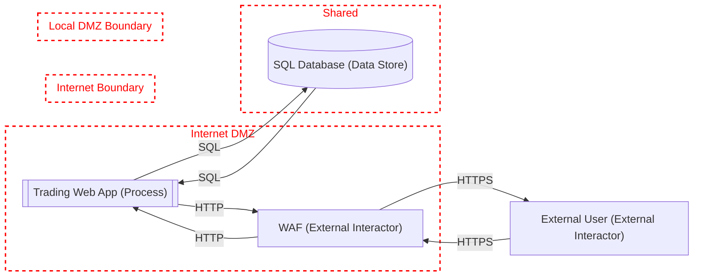
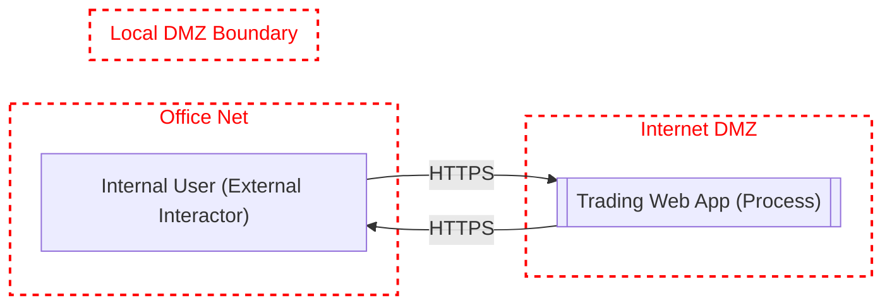
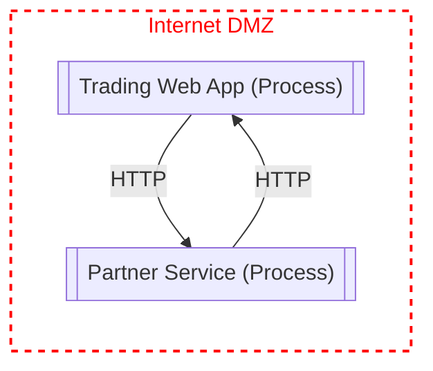

# Threat Model: Untitled

## Metadata
- **Owner:** 
- **Reviewer:** 
- **Date:** 2026-04-12
- **Description:** 
- **Assumptions:** 
- **External Dependencies:** 

## Diagram: External Access

### Data Flow Diagram

### Elements

| Name | Type | Generic Type | Notes |
|------|------|-------------|-------|
| External User | External Interactor | GE.EI |  |
| WAF | External Interactor | GE.EI |  |
| Trading Web App | Process | GE.P |  |
| SQL Database | Data Store | GE.DS |  |

### Data Flows

| Name | Source | Target | Protocol | Authenticates Source | Provides Confidentiality | Provides Integrity |
|------|--------|--------|----------|---------------------|-------------------------|-------------------|
| SQL | Trading Web App | SQL Database | SE.DF.TMCore.ALPC | Yes | No | No |
| SQL | SQL Database | Trading Web App | SE.DF.TMCore.ALPC | Yes | No | No |
| HTTPS | WAF | External User | SE.DF.TMCore.HTTPS | Yes | Yes | Yes |
| HTTPS | External User | WAF | SE.DF.TMCore.HTTPS | Yes | Yes | Yes |
| HTTP | WAF | Trading Web App | SE.DF.TMCore.HTTP | Yes | No | No |
| HTTP | Trading Web App | WAF | SE.DF.TMCore.HTTP | Yes | No | No |

### Trust Boundaries

| Name | Elements |
|------|----------|
| Internet DMZ | Trading Web App, WAF |
| Shared | SQL Database |
| Internet Boundary |  |
| Local DMZ Boundary |  |

## Diagram: Internal Access

### Data Flow Diagram

### Elements

| Name | Type | Generic Type | Notes |
|------|------|-------------|-------|
| Internal User | External Interactor | GE.EI |  |
| Trading Web App | Process | GE.P |  |

### Data Flows

| Name | Source | Target | Protocol | Authenticates Source | Provides Confidentiality | Provides Integrity |
|------|--------|--------|----------|---------------------|-------------------------|-------------------|
| HTTPS | Internal User | Trading Web App | SE.DF.TMCore.HTTPS | Yes | Yes | Yes |
| HTTPS | Trading Web App | Internal User | SE.DF.TMCore.HTTPS | Yes | Yes | Yes |

### Trust Boundaries

| Name | Elements |
|------|----------|
| Office Net | Internal User |
| Internet DMZ | Trading Web App |
| Local DMZ Boundary |  |

## Diagram: Service Access

### Data Flow Diagram

### Elements

| Name | Type | Generic Type | Notes |
|------|------|-------------|-------|
| Partner Service | Process | GE.P |  |
| Trading Web App | Process | GE.P |  |

### Data Flows

| Name | Source | Target | Protocol | Authenticates Source | Provides Confidentiality | Provides Integrity |
|------|--------|--------|----------|---------------------|-------------------------|-------------------|
| HTTP | Partner Service | Trading Web App | SE.DF.TMCore.HTTP | Yes | No | No |
| HTTP | Trading Web App | Partner Service | SE.DF.TMCore.HTTP | Not Selected | No | No |

### Trust Boundaries

| Name | Elements |
|------|----------|
| Internet DMZ | Trading Web App, Partner Service |

## Threats

### 25: Potential SQL Injection Vulnerability for SQL Database
- **Category:** Tampering
- **State:** Auto Generated
- **Priority:** High
- **Risk:** High
- **Description:** SQL injection is an attack in which malicious code is inserted into strings that are later passed to an instance of SQL Server for parsing and execution. Any procedure that constructs SQL statements should be reviewed for injection vulnerabilities because SQL Server will execute all syntactically valid queries that it receives. Even parameterized data can be manipulated by a skilled and determined attacker.
- **Target:** SQL Database
- **Source:** Trading Web App
- **Flow:** SQL
- **Mitigation:** 
- **Justification:** 

### 1: Weak Access Control for a Resource
- **Category:** Information Disclosure
- **State:** Auto Generated
- **Priority:** High
- **Risk:** High
- **Description:** Improper data protection of Trading Web App can allow an attacker to read information not intended for disclosure. Review authorization settings.
- **Target:** SQL Database
- **Source:** Trading Web App
- **Flow:** SQL
- **Mitigation:** 
- **Justification:** 

### 45: Potential Data Repudiation by Web Application
- **Category:** Repudiation
- **State:** Auto Generated
- **Priority:** High
- **Risk:** High
- **Description:** Trading Web App claims that it did not receive data from a source outside the trust boundary. Consider using logging or auditing to record the source, time, and summary of the received data.
- **Target:** Trading Web App
- **Source:** WAF
- **Flow:** HTTP
- **Mitigation:** 
- **Justification:** 

### 44: Potential Lack of Input Validation for Web Application
- **Category:** Tampering
- **State:** Auto Generated
- **Priority:** High
- **Risk:** High
- **Description:** Data flowing across HTTP may be tampered with by an attacker. This may lead to a denial of service attack against Trading Web App or an elevation of privilege attack against Trading Web App or an information disclosure by Trading Web App. Failure to verify that input is as expected is a root cause of a very large number of exploitable issues. Consider all paths and the way they handle data. Verify that all input is verified for correctness using an approved list input validation approach.
- **Target:** Trading Web App
- **Source:** WAF
- **Flow:** HTTP
- **Mitigation:** 
- **Justification:** 

### 113: Authenticated Data Flow Compromised
- **Category:** Tampering
- **State:** Auto Generated
- **Priority:** High
- **Risk:** High
- **Description:** An attacker can read or modify data transmitted over an authenticated dataflow.
- **Target:** WAF
- **Source:** Trading Web App
- **Flow:** HTTP
- **Mitigation:** 
- **Justification:** 

### 47: Cross-Site Request Forgery (CSRF)
- **Category:** Elevation Of Privilege
- **State:** Auto Generated
- **Priority:** High
- **Risk:** Medium
- **Description:** Cross-site request forgery (CSRF or XSRF) is2 a type of attack in which an attacker forces a user's browser to make a forged request to a vulnerable site by exploiting an existing trust relationship between the browser and the vulnerable web site.  In a simple scenario, a user is logged in to web site A using a cookie as a credential.  The other browses to web site B.  Web site B returns a page with a hidden form that posts to web site A.  Since the browser will carry the user's cookie to web site A, web site B now can take any action on web site A, for example, adding an admin to an account.  The attack can be used to exploit any requests that the browser automatically authenticates, e.g. by session cookie, integrated authentication, IP whitelisting, …  The attack can be carried out in many ways such as by luring the victim to a site under control of the attacker, getting the user to click a link in a phishing email, or hacking a reputable web site that the victim will visit. The issue can only be resolved on the server side by requiring that all authenticated state-changing requests include an additional piece of secret payload (canary or CSRF token) which is known only to the legitimate web site and the browser and which is protected in transit through SSL/TLS. See the Forgery Protection property on the flow stencil for a list of mitigations.
- **Target:** Trading Web App
- **Source:** WAF
- **Flow:** HTTP
- **Mitigation:** 
- **Justification:** 

### 48: Elevation Using Impersonation
- **Category:** Elevation Of Privilege
- **State:** Auto Generated
- **Priority:** High
- **Risk:** High
- **Description:** Trading Web App may be able to impersonate the context of WAF in order to gain additional privilege.
- **Target:** Trading Web App
- **Source:** WAF
- **Flow:** HTTP
- **Mitigation:** 
- **Justification:** 

### 49: Elevation by Changing the Execution Flow in Web Application
- **Category:** Elevation Of Privilege
- **State:** Auto Generated
- **Priority:** High
- **Risk:** High
- **Description:** An attacker may pass data into Trading Web App in order to change the flow of program execution within Trading Web App to the attacker's choosing.
- **Target:** Trading Web App
- **Source:** WAF
- **Flow:** HTTP
- **Mitigation:** 
- **Justification:** 

### 50: Spoofing of the WA External Destination Entity
- **Category:** Spoofing
- **State:** Auto Generated
- **Priority:** High
- **Risk:** High
- **Description:** WAF may be spoofed by an attacker and this may lead to data being sent to the attacker's target instead of WAF. Consider using a standard authentication mechanism to identify the external entity.
- **Target:** WAF
- **Source:** Trading Web App
- **Flow:** HTTP
- **Mitigation:** 
- **Justification:** 

### 51: External Entity WA Potentially Denies Receiving Data
- **Category:** Repudiation
- **State:** Auto Generated
- **Priority:** High
- **Risk:** High
- **Description:** WAF claims that it did not receive data from a process on the other side of the trust boundary. Consider using logging or auditing to record the source, time, and summary of the received data.
- **Target:** WAF
- **Source:** Trading Web App
- **Flow:** HTTP
- **Mitigation:** 
- **Justification:** 

### 52: XML DTD and XSLT Processing
- **Category:** Tampering
- **State:** Auto Generated
- **Priority:** High
- **Risk:** High
- **Description:** If a dataflow contains XML, XML processing threats (DTD and XSLT code execution) may be exploited.
- **Target:** Trading Web App
- **Source:** WAF
- **Flow:** HTTP
- **Mitigation:** 
- **Justification:** 

### 53: Missing XML Validation
- **Category:** Tampering
- **State:** Auto Generated
- **Priority:** High
- **Risk:** High
- **Description:** Failure to enable validation when parsing XML gives an attacker the opportunity to supply malicious input. Most successful attacks begin with a violation of the programmer's assumptions. By accepting an XML document without validating it against a DTD or XML schema, the programmer leaves a door open for attackers to provide unexpected, unreasonable, or malicious input. It is not possible for an XML parser to validate all aspects of a document's content; a parser cannot understand the complete semantics of the data. However, a parser can do a complete and thorough job of checking the document's structure and therefore guarantee to the code that processes the document that the content is well-formed. 
- **Target:** Trading Web App
- **Source:** WAF
- **Flow:** HTTP
- **Mitigation:** 
- **Justification:** 

### 90: Elevation by Changing the Execution Flow in Web Application
- **Category:** Elevation Of Privilege
- **State:** Auto Generated
- **Priority:** High
- **Risk:** High
- **Description:** An attacker may pass data into Trading Web App in order to change the flow of program execution within Trading Web App to the attacker's choosing.
- **Target:** Trading Web App
- **Source:** SQL Database
- **Flow:** SQL
- **Mitigation:** 
- **Justification:** 

### 89: Cross-Site Request Forgery (CSRF)
- **Category:** Elevation Of Privilege
- **State:** Auto Generated
- **Priority:** High
- **Risk:** Medium
- **Description:** Cross-site request forgery (CSRF or XSRF) is2 a type of attack in which an attacker forces a user's browser to make a forged request to a vulnerable site by exploiting an existing trust relationship between the browser and the vulnerable web site.  In a simple scenario, a user is logged in to web site A using a cookie as a credential.  The other browses to web site B.  Web site B returns a page with a hidden form that posts to web site A.  Since the browser will carry the user's cookie to web site A, web site B now can take any action on web site A, for example, adding an admin to an account.  The attack can be used to exploit any requests that the browser automatically authenticates, e.g. by session cookie, integrated authentication, IP whitelisting, …  The attack can be carried out in many ways such as by luring the victim to a site under control of the attacker, getting the user to click a link in a phishing email, or hacking a reputable web site that the victim will visit. The issue can only be resolved on the server side by requiring that all authenticated state-changing requests include an additional piece of secret payload (canary or CSRF token) which is known only to the legitimate web site and the browser and which is protected in transit through SSL/TLS. See the Forgery Protection property on the flow stencil for a list of mitigations.
- **Target:** Trading Web App
- **Source:** SQL Database
- **Flow:** SQL
- **Mitigation:** 
- **Justification:** 

### 88: Data Store Inaccessible
- **Category:** Denial Of Service
- **State:** Auto Generated
- **Priority:** High
- **Risk:** High
- **Description:** An external agent prevents access to a data store on the other side of the trust boundary.
- **Target:** Trading Web App
- **Source:** SQL Database
- **Flow:** SQL
- **Mitigation:** 
- **Justification:** 

### 87: Potential Process Crash or Stop for Web Application
- **Category:** Denial Of Service
- **State:** Auto Generated
- **Priority:** High
- **Risk:** High
- **Description:** Trading Web App crashes, halts, stops or runs slowly; in all cases violating an availability metric.
- **Target:** Trading Web App
- **Source:** SQL Database
- **Flow:** SQL
- **Mitigation:** 
- **Justification:** 

### 86: Potential Data Repudiation by Web Application
- **Category:** Repudiation
- **State:** Auto Generated
- **Priority:** High
- **Risk:** High
- **Description:** Trading Web App claims that it did not receive data from a source outside the trust boundary. Consider using logging or auditing to record the source, time, and summary of the received data.
- **Target:** Trading Web App
- **Source:** SQL Database
- **Flow:** SQL
- **Mitigation:** 
- **Justification:** 

### 85: Data Store Inaccessible
- **Category:** Denial Of Service
- **State:** Auto Generated
- **Priority:** High
- **Risk:** High
- **Description:** An external agent prevents access to a data store on the other side of the trust boundary.
- **Target:** SQL Database
- **Source:** Trading Web App
- **Flow:** SQL
- **Mitigation:** 
- **Justification:** 

### 84: Data Flow Sniffing
- **Category:** Information Disclosure
- **State:** Auto Generated
- **Priority:** High
- **Risk:** High
- **Description:** Data flowing across SQL may be sniffed by an attacker. Depending on what type of data an attacker can read, it may be used to attack other parts of the system or simply be a disclosure of information leading to compliance violations. Consider encrypting the data flow.
- **Target:** SQL Database
- **Source:** Trading Web App
- **Flow:** SQL
- **Mitigation:** 
- **Justification:** 

### 83: Data Store Denies SQL Database Potentially Writing Data
- **Category:** Repudiation
- **State:** Auto Generated
- **Priority:** High
- **Risk:** High
- **Description:** SQL Database claims that it did not write data received from an entity on the other side of the trust boundary. Consider using logging or auditing to record the source, time, and summary of the received data.
- **Target:** SQL Database
- **Source:** Trading Web App
- **Flow:** SQL
- **Mitigation:** 
- **Justification:** 

### 82: The SQL Database Data Store Could Be Corrupted
- **Category:** Tampering
- **State:** Auto Generated
- **Priority:** High
- **Risk:** High
- **Description:** Data flowing across SQL may be tampered with by an attacker. This may lead to corruption of SQL Database. Ensure the integrity of the data flow to the data store.
- **Target:** SQL Database
- **Source:** Trading Web App
- **Flow:** SQL
- **Mitigation:** 
- **Justification:** 

### 91: Insecure Communication (Demo)
- **Category:** Compliance
- **State:** Auto Generated
- **Priority:** High
- **Risk:** High
- **Description:** Direct communication from DMZ to Office Network is not allowed.
- **Target:** Trading Web App
- **Source:** Internal User
- **Flow:** HTTPS
- **Mitigation:** 
- **Justification:** 

### 92: Cross-Site Scripting (XSS)
- **Category:** Tampering
- **State:** Auto Generated
- **Priority:** High
- **Risk:** High
- **Description:** The web server 'Trading Web App' could be a subject to a cross-site scripting attack because it does not sanitize untrusted input.
- **Target:** Trading Web App
- **Source:** Internal User
- **Flow:** HTTPS
- **Mitigation:** 
- **Justification:** 

### 93: Potential Remote Code Execution
- **Category:** Tampering
- **State:** Auto Generated
- **Priority:** High
- **Risk:** High
- **Description:** Internal User may be able to remotely execute code for Trading Web App.
- **Target:** Trading Web App
- **Source:** Internal User
- **Flow:** HTTPS
- **Mitigation:** 
- **Justification:** 

### 94: Potential Data Repudiation by Trading Web App
- **Category:** Repudiation
- **State:** Auto Generated
- **Priority:** High
- **Risk:** High
- **Description:** Trading Web App claims that it did not receive data from a source outside the trust boundary. Consider using logging or auditing to record the source, time, and summary of the received data.
- **Target:** Trading Web App
- **Source:** Internal User
- **Flow:** HTTPS
- **Mitigation:** 
- **Justification:** 

### 95: Potential Process Crash or Stop for Trading Web App
- **Category:** Denial Of Service
- **State:** Auto Generated
- **Priority:** High
- **Risk:** High
- **Description:** Trading Web App crashes, halts, stops or runs slowly; in all cases violating an availability metric.
- **Target:** Trading Web App
- **Source:** Internal User
- **Flow:** HTTPS
- **Mitigation:** 
- **Justification:** 

### 96: Cross-Site Request Forgery (CSRF)
- **Category:** Elevation Of Privilege
- **State:** Auto Generated
- **Priority:** High
- **Risk:** Medium
- **Description:** Cross-site request forgery (CSRF or XSRF) is2 a type of attack in which an attacker forces a user's browser to make a forged request to a vulnerable site by exploiting an existing trust relationship between the browser and the vulnerable web site.  In a simple scenario, a user is logged in to web site A using a cookie as a credential.  The other browses to web site B.  Web site B returns a page with a hidden form that posts to web site A.  Since the browser will carry the user's cookie to web site A, web site B now can take any action on web site A, for example, adding an admin to an account.  The attack can be used to exploit any requests that the browser automatically authenticates, e.g. by session cookie, integrated authentication, IP whitelisting, …  The attack can be carried out in many ways such as by luring the victim to a site under control of the attacker, getting the user to click a link in a phishing email, or hacking a reputable web site that the victim will visit. The issue can only be resolved on the server side by requiring that all authenticated state-changing requests include an additional piece of secret payload (canary or CSRF token) which is known only to the legitimate web site and the browser and which is protected in transit through SSL/TLS. See the Forgery Protection property on the flow stencil for a list of mitigations.
- **Target:** Trading Web App
- **Source:** Internal User
- **Flow:** HTTPS
- **Mitigation:** 
- **Justification:** 

### 97: Elevation Using Impersonation
- **Category:** Elevation Of Privilege
- **State:** Auto Generated
- **Priority:** High
- **Risk:** High
- **Description:** Trading Web App may be able to impersonate the context of Internal User in order to gain additional privilege.
- **Target:** Trading Web App
- **Source:** Internal User
- **Flow:** HTTPS
- **Mitigation:** 
- **Justification:** 

### 98: Elevation by Changing the Execution Flow in Trading Web App
- **Category:** Elevation Of Privilege
- **State:** Auto Generated
- **Priority:** High
- **Risk:** High
- **Description:** An attacker may pass data into Trading Web App in order to change the flow of program execution within Trading Web App to the attacker's choosing.
- **Target:** Trading Web App
- **Source:** Internal User
- **Flow:** HTTPS
- **Mitigation:** 
- **Justification:** 

### 99: Insecure Communication (Demo)
- **Category:** Compliance
- **State:** Auto Generated
- **Priority:** High
- **Risk:** High
- **Description:** Direct communication from DMZ to Office Network is not allowed.
- **Target:** Internal User
- **Source:** Trading Web App
- **Flow:** HTTPS
- **Mitigation:** 
- **Justification:** 

### 100: External Entity Internal User Potentially Denies Receiving Data
- **Category:** Repudiation
- **State:** Auto Generated
- **Priority:** High
- **Risk:** High
- **Description:** Internal User claims that it did not receive data from a process on the other side of the trust boundary. Consider using logging or auditing to record the source, time, and summary of the received data.
- **Target:** Internal User
- **Source:** Trading Web App
- **Flow:** HTTPS
- **Mitigation:** 
- **Justification:** 

### 101: Web Service Process Memory Tampered
- **Category:** Tampering
- **State:** Auto Generated
- **Priority:** High
- **Risk:** High
- **Description:** If Partner Service is given access to memory, such as shared memory or pointers, or is given the ability to control what Trading Web App executes (for example, passing back a function pointer.), then Partner Service can tamper with Trading Web App. Consider if the function could work with less access to memory, such as passing data rather than pointers. Copy in data provided, and then validate it.
- **Target:** Trading Web App
- **Source:** Partner Service
- **Flow:** HTTP
- **Mitigation:** 
- **Justification:** 

### 102: Elevation Using Impersonation
- **Category:** Elevation Of Privilege
- **State:** Auto Generated
- **Priority:** High
- **Risk:** High
- **Description:** Trading Web App may be able to impersonate the context of Partner Service in order to gain additional privilege.
- **Target:** Trading Web App
- **Source:** Partner Service
- **Flow:** HTTP
- **Mitigation:** 
- **Justification:** 

### 103: Trading Web App Process Memory Tampered
- **Category:** Tampering
- **State:** Auto Generated
- **Priority:** High
- **Risk:** High
- **Description:** If Trading Web App is given access to memory, such as shared memory or pointers, or is given the ability to control what Partner Service executes (for example, passing back a function pointer.), then Trading Web App can tamper with Partner Service. Consider if the function could work with less access to memory, such as passing data rather than pointers. Copy in data provided, and then validate it.
- **Target:** Partner Service
- **Source:** Trading Web App
- **Flow:** HTTP
- **Mitigation:** 
- **Justification:** 

### 104: Elevation Using Impersonation
- **Category:** Elevation Of Privilege
- **State:** Auto Generated
- **Priority:** High
- **Risk:** High
- **Description:** Partner Service may be able to impersonate the context of Trading Web App in order to gain additional privilege.
- **Target:** Partner Service
- **Source:** Trading Web App
- **Flow:** HTTP
- **Mitigation:** 
- **Justification:** 

### 105: Authenticated Data Flow Compromised
- **Category:** Tampering
- **State:** Auto Generated
- **Priority:** High
- **Risk:** High
- **Description:** An attacker can read or modify data transmitted over an authenticated dataflow.
- **Target:** Trading Web App
- **Source:** Partner Service
- **Flow:** HTTP
- **Mitigation:** 
- **Justification:** 

### 106: XML DTD and XSLT Processing
- **Category:** Tampering
- **State:** Auto Generated
- **Priority:** High
- **Risk:** High
- **Description:** If a dataflow contains XML, XML processing threats (DTD and XSLT code execution) may be exploited.
- **Target:** Trading Web App
- **Source:** Partner Service
- **Flow:** HTTP
- **Mitigation:** 
- **Justification:** 

### 107: Missing XML Validation
- **Category:** Tampering
- **State:** Auto Generated
- **Priority:** High
- **Risk:** High
- **Description:** Failure to enable validation when parsing XML gives an attacker the opportunity to supply malicious input. Most successful attacks begin with a violation of the programmer's assumptions. By accepting an XML document without validating it against a DTD or XML schema, the programmer leaves a door open for attackers to provide unexpected, unreasonable, or malicious input. It is not possible for an XML parser to validate all aspects of a document's content; a parser cannot understand the complete semantics of the data. However, a parser can do a complete and thorough job of checking the document's structure and therefore guarantee to the code that processes the document that the content is well-formed. 
- **Target:** Trading Web App
- **Source:** Partner Service
- **Flow:** HTTP
- **Mitigation:** 
- **Justification:** 

### 108: XML DTD and XSLT Processing
- **Category:** Tampering
- **State:** Auto Generated
- **Priority:** High
- **Risk:** High
- **Description:** If a dataflow contains XML, XML processing threats (DTD and XSLT code execution) may be exploited.
- **Target:** Partner Service
- **Source:** Trading Web App
- **Flow:** HTTP
- **Mitigation:** 
- **Justification:** 

### 109: Missing XML Validation
- **Category:** Tampering
- **State:** Auto Generated
- **Priority:** High
- **Risk:** High
- **Description:** Failure to enable validation when parsing XML gives an attacker the opportunity to supply malicious input. Most successful attacks begin with a violation of the programmer's assumptions. By accepting an XML document without validating it against a DTD or XML schema, the programmer leaves a door open for attackers to provide unexpected, unreasonable, or malicious input. It is not possible for an XML parser to validate all aspects of a document's content; a parser cannot understand the complete semantics of the data. However, a parser can do a complete and thorough job of checking the document's structure and therefore guarantee to the code that processes the document that the content is well-formed. 
- **Target:** Partner Service
- **Source:** Trading Web App
- **Flow:** HTTP
- **Mitigation:** 
- **Justification:** 

### 110: Authenticated Data Flow Compromised
- **Category:** Tampering
- **State:** Auto Generated
- **Priority:** High
- **Risk:** High
- **Description:** An attacker can read or modify data transmitted over an authenticated dataflow.
- **Target:** SQL Database
- **Source:** Trading Web App
- **Flow:** SQL
- **Mitigation:** 
- **Justification:** 

### 111: Authenticated Data Flow Compromised
- **Category:** Tampering
- **State:** Auto Generated
- **Priority:** High
- **Risk:** High
- **Description:** An attacker can read or modify data transmitted over an authenticated dataflow.
- **Target:** Trading Web App
- **Source:** SQL Database
- **Flow:** SQL
- **Mitigation:** 
- **Justification:** 

### 112: Authenticated Data Flow Compromised
- **Category:** Tampering
- **State:** Auto Generated
- **Priority:** High
- **Risk:** High
- **Description:** An attacker can read or modify data transmitted over an authenticated dataflow.
- **Target:** Trading Web App
- **Source:** WAF
- **Flow:** HTTP
- **Mitigation:** 
- **Justification:** 
