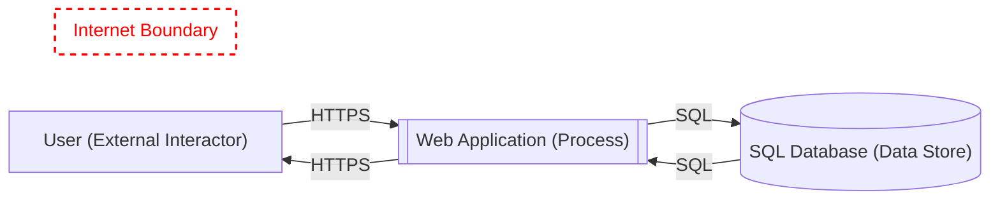

# Threat Model: Untitled

## Metadata
- **Owner:** 
- **Reviewer:** 
- **Date:** 2026-04-12
- **Description:** 
- **Assumptions:** 
- **External Dependencies:** 

## Data Flow Diagram

## Elements

| Name | Type | Generic Type | Notes |
|------|------|-------------|-------|
| User | External Interactor | GE.EI |  |
| Web Application | Process | GE.P |  |
| SQL Database | Data Store | GE.DS |  |

## Data Flows

| Name | Source | Target | Protocol | Authenticates Source | Provides Confidentiality | Provides Integrity |
|------|--------|--------|----------|---------------------|-------------------------|-------------------|
| SQL | Web Application | SQL Database | SE.DF.TMCore.ALPC | Not Selected | No | No |
| SQL | SQL Database | Web Application | SE.DF.TMCore.ALPC | Not Selected | No | No |
| HTTPS | Web Application | User | SE.DF.TMCore.HTTPS | Not Selected | Yes | Yes |
| HTTPS | User | Web Application | SE.DF.TMCore.HTTPS | No | Yes | Yes |

## Trust Boundaries

| Name | Elements |
|------|----------|
| Internet Boundary |  |

## Threats

### 25: Potential SQL Injection Vulnerability for SQL Database
- **Category:** Tampering
- **State:** Needs Investigation
- **Priority:** High
- **Risk:** High
- **Description:** SQL injection is an attack in which malicious code is inserted into strings that are later passed to an instance of SQL Server for parsing and execution. Any procedure that constructs SQL statements should be reviewed for injection vulnerabilities because SQL Server will execute all syntactically valid queries that it receives. Even parameterized data can be manipulated by a skilled and determined attacker.
- **Target:** SQL Database
- **Source:** Web Application
- **Flow:** SQL
- **Mitigation:** Hibernate + Criterias should be used as persistance layer
- **Justification:** 

### 1: Weak Access Control for a Resource
- **Category:** Information Disclosure
- **State:** Mitigated
- **Priority:** High
- **Risk:** High
- **Description:** Improper data protection of Web Application can allow an attacker to read information not intended for disclosure. Review authorization settings.
- **Target:** SQL Database
- **Source:** Web Application
- **Flow:** SQL
- **Mitigation:** 
- **Justification:** 

### 24: Potential Process Crash or Stop for Web Application
- **Category:** Denial Of Service
- **State:** Not Applicable
- **Priority:** High
- **Risk:** High
- **Description:** Web Application crashes, halts, stops or runs slowly; in all cases violating an availability metric.
- **Target:** Web Application
- **Source:** User
- **Flow:** HTTPS
- **Mitigation:** 
- **Justification:** 

### 23: Potential Data Repudiation by Web Application
- **Category:** Repudiation
- **State:** Not Applicable
- **Priority:** High
- **Risk:** High
- **Description:** Web Application claims that it did not receive data from a source outside the trust boundary. Consider using logging or auditing to record the source, time, and summary of the received data.
- **Target:** Web Application
- **Source:** User
- **Flow:** HTTPS
- **Mitigation:** 
- **Justification:** 

### 22: Potential Remote Code Execution
- **Category:** Tampering
- **State:** Not Applicable
- **Priority:** High
- **Risk:** High
- **Description:** User may be able to remotely execute code for Web Application.
- **Target:** Web Application
- **Source:** User
- **Flow:** HTTPS
- **Mitigation:** 
- **Justification:** 

### 21: Cross-Site Scripting (XSS)
- **Category:** Tampering
- **State:** Needs Investigation
- **Priority:** High
- **Risk:** High
- **Description:** The web server 'Web Application' could be a subject to a cross-site scripting attack because it does not sanitize untrusted input.
- **Target:** Web Application
- **Source:** User
- **Flow:** HTTPS
- **Mitigation:** Encode Output in application / Apply CSP
- **Justification:** 

### 20: Spoofing the User External Entity
- **Category:** Spoofing
- **State:** Needs Investigation
- **Priority:** High
- **Risk:** High
- **Description:** User may be spoofed by an attacker and this may lead to unauthorized access to Web Application. Consider using a standard authentication mechanism to identify the external entity.
- **Target:** Web Application
- **Source:** User
- **Flow:** HTTPS
- **Mitigation:** Should be handled by strong authentication method
- **Justification:** 

### 18: Invalid Internet Access (Demo)
- **Category:** Compliance
- **State:** Needs Investigation
- **Priority:** High
- **Risk:** High
- **Description:** Web Applications should not directly connected to the Internet
- **Target:** Web Application
- **Source:** User
- **Flow:** HTTPS
- **Mitigation:** 
- **Justification:** 

### 17: External Entity User Potentially Denies Receiving Data
- **Category:** Repudiation
- **State:** Not Applicable
- **Priority:** High
- **Risk:** High
- **Description:** User claims that it did not receive data from a process on the other side of the trust boundary. Consider using logging or auditing to record the source, time, and summary of the received data.
- **Target:** User
- **Source:** Web Application
- **Flow:** HTTPS
- **Mitigation:** 
- **Justification:** 

### 16: Spoofing of the User External Destination Entity
- **Category:** Spoofing
- **State:** Not Applicable
- **Priority:** High
- **Risk:** High
- **Description:** User may be spoofed by an attacker and this may lead to data being sent to the attacker's target instead of User. Consider using a standard authentication mechanism to identify the external entity.
- **Target:** User
- **Source:** Web Application
- **Flow:** HTTPS
- **Mitigation:** 
- **Justification:** 
